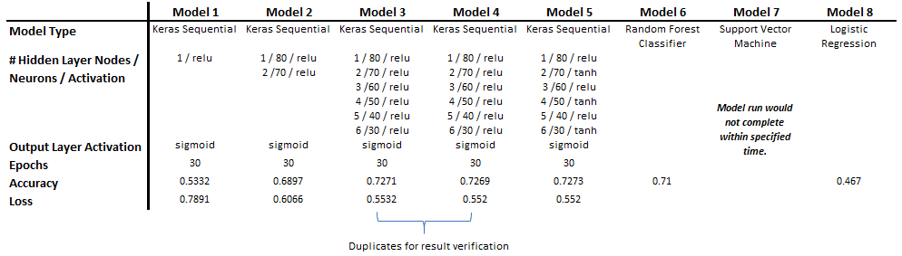

# Neural_Network_Charity_Analysis
----------------------------------------------------------------------------------

## Overview of the Statistical Analysis 
Implement a neural network, using the TensorFlow platform in Python, to model (train and test) a dataset containing 34,000 organizations that have previously received funding. The model output is a binary classifier capable of predicting successful donation outcomes.  

## Data Sources and Coding Files
Data for analysis was provided within the attached ([CSV file). ](/Resources/charity_data.csv)

Statistical analysis was performed in Python and is attached:  [AlphabetSoupCharity](AlphabetSoupCharity.ipynb), and [AlphabetSoupCharity_Optimization](AlphabetSoupCharity_Optimization.ipynb).

The data contained the following features:
- APPLICATION_TYPE—Alphabet Soup application type
- AFFILIATION—Affiliated sector of industry
- CLASSIFICATION—Government organization classification
- USE_CASE—Use case for funding
- ORGANIZATION—Organization type
- STATUS—Active status
- INCOME_AMT—Income classification
- SPECIAL_CONSIDERATIONS—Special consideration for application
- ASK_AMT—Funding amount requested

The following was the target variable:
- IS_SUCCESSFUL—Was the money used effectively

The following two columns were removed from the model because they were simply identifications for the features.  
- EIN and NAME—Identification columns

## Procedure
1. Import dependencies 
2. Import data set
3. Preprocess Data
4. Generate a OneHotEncoder instance
5. Fit and transform OneHotEncoder
6. Add the encoded variables to a dataframe
7. Merge OneHotEncoder features and drop originals
8. Split the preprocessed data into features and target
9. Split the preprocessed data into training and testing data
10. Create a StandardScaler
11. Fit the StandardScaler
12. Define the model
13. Where appropriate, define and add hidden layers
14. Where appropriate, define and add the output layer
15. Run the model

## Results

The above table provides the results of 8 different models.  Note the Random Forest Classifier performed nearly equal to the best neural network models. 

